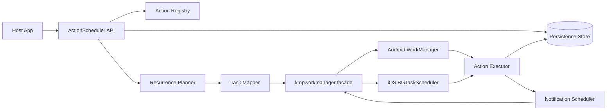
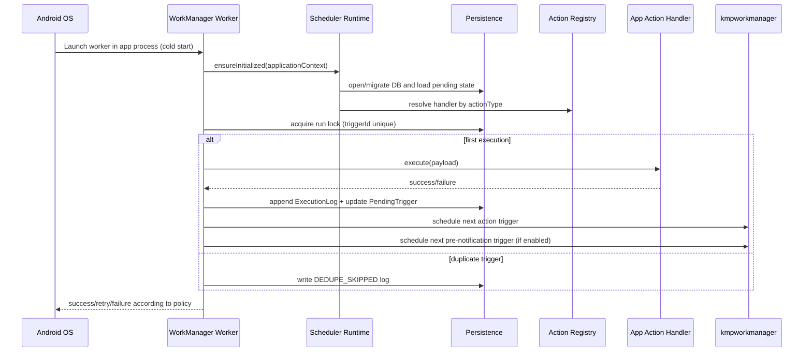

# Action Scheduler SDK - High Level Design (Draft v1)

This draft proposes a Kotlin Multiplatform (KMP) Action Scheduler SDK that uses `kmpworkmanager` directly in v1 to run scheduled actions reliably on Android and iOS, with execution history, failure tracking, and optional pre-action notifications.

## 1. Goals

Based on the assignment requirements, the SDK must:

1. Support flexible recurrence rules (daily, weekly, monthly, one-time).
2. Survive app restarts and execute through OS background scheduling.
3. Track execution history (time, status, duration, error details).
4. Expose query APIs for recent successful/failed runs.
5. Support optional pre-action notification offsets (for example, T-24h).
6. Be KMP-first and usable from Android and iOS with one common API.

## 2. What makes this a good KMP library

1. **Common-first API**: no platform branching required for core scheduling calls.
2. **Capability-aware behavior**: platform limits are explicit (especially iOS timing guarantees).
3. **Deterministic core logic**: recurrence calculation and state transitions live in `commonMain`.
4. **Reliable persistence**: task state and run ledgers survive process death/cold start.
5. **Idempotent execution**: duplicate triggers do not duplicate business side effects.
6. **Low integration friction**: simple initialization contract for host app startup.
7. **Observable operations**: status, duration, failures, and diagnostics are queryable.

## 3. Scope and non-goals (v1)

### In scope
- Recurring and one-time actions.
- Background execution through `kmpworkmanager`.
- Run history and failure logs.
- Optional pre-action notifications.
- Minimal host app sample wiring with at least two actions.

### Out of scope (v1)
- Building a custom scheduler engine.
- Guaranteed exact execution time on iOS.
- Complex multi-step action chains as first-class API.

## 4. Requirement-to-design mapping

| Requirement | Design in this HLD |
| --- | --- |
| Daily/weekly/monthly schedules | `RecurrenceRule` + `RecurrencePlanner` computes next trigger and schedules one-shot jobs |
| Works after restart/offline/idle | Persisted action state + OS-backed execution via `kmpworkmanager` |
| Failed task log | `ExecutionLog` with status, error reason, and retry metadata |
| Track past runs (time/status/duration) | Append-only run ledger and query API |
| Query recent executions | `getRecentExecutions()` with filters |
| Notification flag before action | Notification sub-schedule derived from same recurrence |
| KMP library | Shared core in `commonMain`; platform adapters in `androidMain`/`iosMain` |

## 5. Proposed architecture (v1: direct `kmpworkmanager`)



### Layer responsibilities

1. **Public API layer (`commonMain`)**
   - Register/update/cancel action schedules.
   - Query execution history.
   - Register handlers for action types.

2. **Domain orchestration (`commonMain`)**
   - Recurrence planning.
   - Action state machine (`SCHEDULED -> RUNNING -> SUCCESS/FAILED/RETRY`).
   - Idempotency and dedup logic.

3. **Scheduling engine integration (`commonMain` + platform internals)**
   - Map scheduler intent to `kmpworkmanager` task requests.
   - Convert runtime callbacks into domain-level execution attempts.

4. **Persistence (`commonMain`, platform DB impl)**
   - Action definitions.
   - Pending trigger metadata.
   - Execution logs.
   - Notification scheduling state.

## 6. Core model (high-level)

```kotlin
data class ActionSpec(
    val actionId: String,
    val actionType: String,
    val payloadJson: String,
    val recurrence: RecurrenceRule,
    val timezone: String,
    val notificationOffsetMinutes: Int?,
    val enabled: Boolean,
)

data class PendingTrigger(
    val triggerId: String,        // actionId + scheduledAtEpochMillis
    val actionId: String,
    val scheduledAtEpochMillis: Long,
    val kind: TriggerKind,        // ACTION or PRE_NOTIFICATION
    val state: TriggerState,      // SCHEDULED/RUNNING/COMPLETED/FAILED
)

data class ExecutionLog(
    val runId: String,
    val actionId: String,
    val scheduledAtEpochMillis: Long,
    val startedAtEpochMillis: Long,
    val endedAtEpochMillis: Long,
    val status: RunStatus,        // SUCCESS/FAILED/RETRY/DEDUPE_SKIPPED
    val errorCode: String?,
    val errorMessage: String?,
)
```

## 7. Scheduling and execution flow

### 7.1 Register/update flow

1. App registers action with recurrence + optional notification offset.
2. SDK validates rule and platform compatibility.
3. SDK stores `ActionSpec`.
4. `RecurrencePlanner` computes next fire times.
5. SDK enqueues one-shot trigger(s) in `kmpworkmanager`.
6. SDK stores `PendingTrigger` records for reconciliation.

Why one-shot trigger scheduling for recurring rules?
- Calendar rules like "every Monday" or "1st of month" are not equivalent to fixed periodic intervals.
- One-shot + re-plan-after-run keeps behavior calendar-correct across DST/timezone shifts.

### 7.2 Fresh launch execution (Android WorkManager cold start)

This is the critical path for "action triggered from fresh launch".



### 7.3 iOS execution notes

- iOS execution is opportunistic. Tasks can be delayed and are not exact-time guarantees.
- If user force-quits app, iOS may cancel pending background execution.
- SDK records platform reason in logs and resumes/reconciles on next launch.

## 8. Corner cases and mitigation matrix

| Corner case | Risk | Mitigation in v1 | Residual behavior |
| --- | --- | --- | --- |
| App/process restart before scheduled time | Lost in-memory state | Persist `ActionSpec` and `PendingTrigger`; reconcile at startup | Next trigger recovered |
| Worker launched in fresh process | Missing handler wiring | Runtime bootstrap + registry rehydrate on worker entry | Fails fast with `HANDLER_NOT_FOUND` if app did not register handler |
| Duplicate trigger delivery | Double side effects | Unique `triggerId` lock + idempotency log | Duplicate attempts become `DEDUPE_SKIPPED` |
| Device off at scheduled time | Missed window | On next boot/launch, detect overdue trigger and execute/catch-up policy | Delay accepted, tracked as late run |
| Offline during execution | Action failure | Retry/backoff policy + status log | Eventually fails with reason if retries exhausted |
| Timezone change | Wrong next due time | Store timezone and recompute next occurrence on time change/startup | One trigger may shift; logged |
| DST transitions | Double/missed local time | Recurrence planner resolves via timezone rules and deterministic policy | Edge local times follow documented policy |
| iOS force-quit | Background tasks canceled | Persist state, reconcile on next open; mark platform limitation | No hard guarantee while force-quit persists |
| Notification permission denied | Missing reminder | Track notification scheduling failure separately from action run | Action still executes |
| Action handler throws/crashes | Partial execution | Catch, classify error, log, retry as configured | Marked failed if retries exhausted |

## 9. Notification-before-action design

1. Notification trigger is derived from action recurrence: `notificationAt = actionAt - offset`.
2. Notification and action use separate trigger IDs but linked by `actionId + scheduledAt`.
3. If schedule changes, SDK cancels stale notification triggers and recalculates.
4. If notification time is in the past (late registration), SDK suppresses stale notification.
5. Notification failures are logged independently and do not block action execution.

## 10. Observability and query APIs

Planned APIs (illustrative):

```kotlin
interface ActionScheduler {
    suspend fun registerAction(spec: ActionSpec): RegistrationResult
    suspend fun updateAction(spec: ActionSpec): RegistrationResult
    suspend fun cancelAction(actionId: String)

    suspend fun getRecentExecutions(
        actionId: String? = null,
        statuses: Set<RunStatus> = emptySet(),
        limit: Int = 50,
    ): List<ExecutionLog>
}
```

Observability fields:
- `scheduledAt`, `startedAt`, `endedAt`, `durationMs`
- `status`
- `errorCode` / `errorMessage`
- `platform` and best-effort `platformReason`

## 11. Direct `kmpworkmanager` adoption (v1)

### Why direct adoption now

1. Faster delivery for assignment timeline.
2. Shared KMP scheduling API already available.
3. Existing support for Android WorkManager and iOS BGTaskScheduler.

### Known trade-offs

1. Dependency surface grows (library behavior/version coupling).
2. Need to align with library lifecycle/DI expectations.
3. Platform capability gaps remain (mainly iOS opportunistic execution).

### Integration boundary decision

Even with direct usage, keep an internal boundary:
- `SchedulerEngine` internal interface in SDK core.
- v1 implementation backed by `kmpworkmanager`.
- Enables v2 custom adapter without rewriting domain logic.

## 12. Host app integration requirements

### Android
- Initialize scheduler runtime during `Application.onCreate`.
- Ensure worker process can bootstrap registry without UI.
- Add required permissions for notification and any exact-alarm use case.

### iOS
- Configure BGTask identifiers and background modes in `Info.plist`.
- Register background tasks during app startup (`AppDelegate`/SwiftUI app init).
- Treat timing as best-effort, not exact.

## 13. Testing strategy (v1)

1. **Common unit tests**
   - Recurrence planner correctness (daily/weekly/monthly/DST/timezone).
   - Idempotency and state transitions.
2. **Android tests**
   - Worker cold-start bootstrap and persistence recovery.
   - Retry/backoff and duplicate-delivery handling.
3. **iOS tests/manual validation**
   - BGTask registration and callback execution.
   - Force-quit behavior documentation and reconciliation on next launch.
4. **Contract tests**
   - Action handler failures and result logging.
   - Notification offset calculation and stale suppression.

## 14. Assumptions and trade-offs

1. Exact wall-clock guarantees are feasible only within platform limits.
2. iOS background execution remains opportunistic by OS policy.
3. Action handlers should be idempotent and bounded in execution time.
4. Persisted ledger retention may require periodic cleanup policy.

## 15. Small v2 roadmap

1. Introduce fully custom scheduler adapter (optional replacement for `kmpworkmanager`).
2. Add advanced flow support (task chaining/batching) where product requires.
3. Add richer analytics/telemetry export hooks.
4. Add policy-driven catch-up modes (skip/multi-catchup/next-only) per action.

---

Reference inputs:
- Assignment requirements: `original_requirements.md`
- External research: `brewkits/kmpworkmanager` docs (API, setup, iOS limitations)
