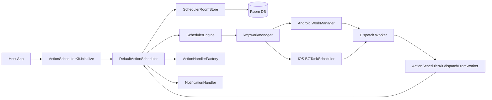
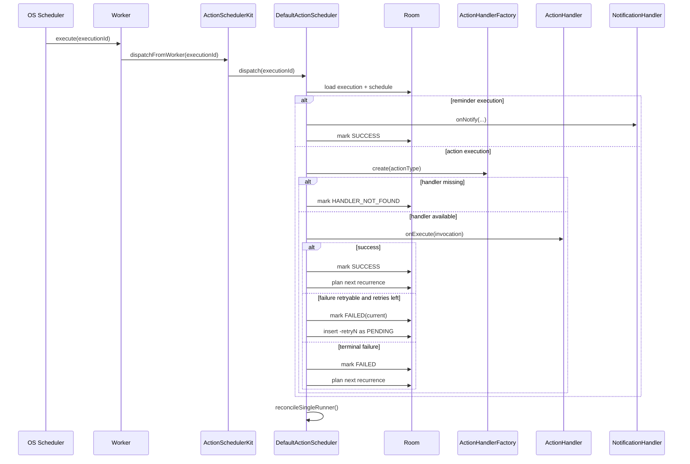

# Action Scheduler SDK - High Level Design

This document proposes the v1 architecture for the `action_scheduler` Kotlin Multiplatform SDK.
It focuses on API contract, system design, lifecycle, and platform constraints before implementation details.

---

## 1) Scope and non-goals (v1)

### In scope

- Register/cancel one-time and recurring actions.
- Recurrence rules: one-time, daily, weekly (`skipWeeks`), monthly.
- Optional pre-action reminder notifications.
- Handler execution via `ActionHandlerFactory`.
- Retryable failures with exponential backoff (max 3 retries).
- Persistent schedules and execution logs (Room + SQLite bundled driver).
- Reactive observability via `Flow`.

### Out of scope

- Exact-time guarantees on iOS.
- A custom scheduler implementation in v1 (the initial adapter is `kmpworkmanager`).
- Rich query APIs (filter/pagination) for logs.
- Complex chained workflows.

---

## 2) Public integration contract

### 2.1 Public API

```kotlin
interface ActionScheduler {
    suspend fun registerAction(spec: ActionSpec): RegistrationResult
    suspend fun cancelAction(actionId: String)

    fun getRegisteredActions(): Flow<List<ActionSpec>>
    fun getExecutionLogs(): Flow<List<ExecutionLog>>

    fun setNotificationHandler(handler: NotificationHandler?)
}

fun interface ActionHandlerFactory {
    fun create(actionType: String): ActionHandler?
}
```

### 2.2 Initialization contract

```kotlin
val scheduler = ActionSchedulerKit.initialize(
    actionHandlerFactory = MyActionHandlerFactory(),
    config = ActionSchedulerConfig(...)
)
```

Important details:

- Initialization should happen early at app startup.
- Android requires `ActionSchedulerConfig.platformContext` as application context.
- iOS task IDs are configured via `ActionSchedulerConfig.iosTaskIds` and must exist in `Info.plist`.

### 2.3 Status/result models

- `RegistrationResult`: `ACCEPTED`, `REJECTED_INVALID_PARAMS`, `REJECTED_PLATFORM_POLICY`, `FAILED`
- `RunStatus`: `SUCCESS`, `FAILED`, `NOT_FOUND`, `DEDUPE_SKIPPED`, `NOTIFICATION_SENT`, `HANDLER_NOT_FOUND`, `RUNNING`, `PENDING`

---

## 3) Architecture overview



### Component responsibilities

1. **ActionSchedulerKit**
   - Holds singleton scheduler instance.
   - Bridges worker callback (`dispatchFromWorker`) to runtime instance.

2. **DefaultActionScheduler (core orchestrator)**
   - Validates specs, persists schedules/executions, dispatches handlers.
   - Computes next occurrence.
   - Reconciles and schedules single nearest runner task.

3. **SchedulerRoomStore**
   - Maps model objects to Room entities.
   - Provides Flow streams and CRUD helpers.
   - Trims execution logs to configured max (with min retention 20).

4. **SchedulerEngine (platform abstraction)**
   - `scheduleRunner(...)`, `cancelRunner(...)`.
   - Planned adapters in `androidMain` and `iosMain` using `kmpworkmanager`.

---

## 4) Data model (v1)

### 4.1 Schedule model

`ActionSpec` includes:

- Identity: `actionId`, `actionType`
- Payload: `payloadJson`
- Recurrence: `RecurrenceRule`
- Timezone: `timezoneId`
- Optional reminder: `notificationOffsetMinutes`, `notificationTitle`, `notificationDescription`
- Execution control: `enabled`, `constraints`

`ActionConstraints`:

- `requiresNetwork`
- `isHeavyTask`
- `backoffDelayMs`

### 4.2 Persistence entities

1. `ActionScheduleEntity` (table: `ActionSchedule`)
   - Stores serialized recurrence + constraints JSON.

2. `ActionExecutionEntity` (table: `ActionExecution`)
   - One row per execution attempt or reminder.
   - Key fields: `id`, `scheduleId`, `scheduledAt`, `startedAt`, `endedAt`, `status`, `retryCount`, `errorCode`, `errorMessage`.

### 4.3 Execution ID conventions

- Main execution: `<actionId>_<scheduledEpochMillis>`
- Reminder execution: `<mainId>-reminder`
- Retry execution: `<baseId>-retryN`

---

## 5) Scheduling lifecycle

### 5.1 Warm start

On initialize, scheduler calls `warmStart()` and reconciles nearest pending execution.

### 5.2 Register action

`registerAction(spec)`:

1. Validate input (`actionId`, `actionType`, recurrence fields, offsets, one-time future check).
2. Upsert schedule.
3. Compute next occurrence from current time + timezone.
4. Insert pending execution row.
5. Insert pending reminder row when offset is present.
6. Reconcile and schedule single nearest runner.

### 5.3 Cancel action

`cancelAction(actionId)`:

1. Delete schedule row.
2. Mark pending executions for that action as `FAILED` with message `Canceled`.
3. Reconcile runner.

### 5.4 Recurrence calculation behavior

- Daily: next same-day or next-day time.
- Weekly: uses `dayOfWeekIso`, `hour`, `minute`, `skipWeeks`.
- Monthly: clamps `dayOfMonth` to month length.
- One-time: only accepted if in future at registration.

---

## 6) Dispatch and retry lifecycle



### Retry policy

- `MAX_RETRIES = 3`
- Delay formula: `max(backoffDelayMs, 5000) * 2^attempt`
- Retry attempt becomes a new execution entity.

### Duplicate/not-found handling

- If execution ID does not exist: create a `NOT_FOUND` log row and return worker success.
- If execution already processed (`status != PENDING`): return success.

---

## 7) Platform adapter design

### 7.1 Android adapter

- Uses `KmpWorkManager` with `AndroidWorkerFactory`.
- Single runner task is scheduled with `ExistingPolicy.REPLACE`.
- Constraints map from `ActionConstraints` to kmpworkmanager constraints.
- DB path: `<context database path>/<storageName>.db`.
- Room config uses `fallbackToDestructiveMigration(true)`.

### 7.2 iOS adapter

- Uses `kmpworkmanager` + Koin module (`kmpWorkerModule`).
- Registers BG task callback and executes via `SingleTaskExecutor`.
- Includes bootstrap handling for platform metadata consistency during scheduling startup.
- DB path: `<Documents>/<storageName>.db`.
- Uses bundled SQLite driver and destructive migration fallback.

---

## 8) Risks and trade-offs (v1)

1. iOS background execution remains best-effort; exact wall-clock timing cannot be guaranteed.
2. Destructive DB migrations simplify rollout but can cause local data loss during schema changes.
3. Reminder schedules may become stale or meaningless if offset pushes reminder into past windows.
4. Retry and backoff strategy increases reliability but may delay eventual terminal failure visibility.
5. Platform task identifier/config mismatches can break background dispatch until corrected.

---

## 9) Future evolution (v2 direction)

1. Add focused query APIs (filters, limits, recent windows).
2. Tighten recurrence validation (`skipWeeks`, reminder-in-past policy).
3. Improve iOS task registration to fully honor configured task IDs.
4. Add migration-safe schema strategy (replace destructive fallback where required).
5. Add production-grade test suite in `commonTest` + platform tests.

---

## References

- Assignment requirements: `original_requirements.md`
- SDK module: `action_scheduler/src/...`
- Sample integration: `composeApp/src/...`, `iosApp/iosApp/...`
